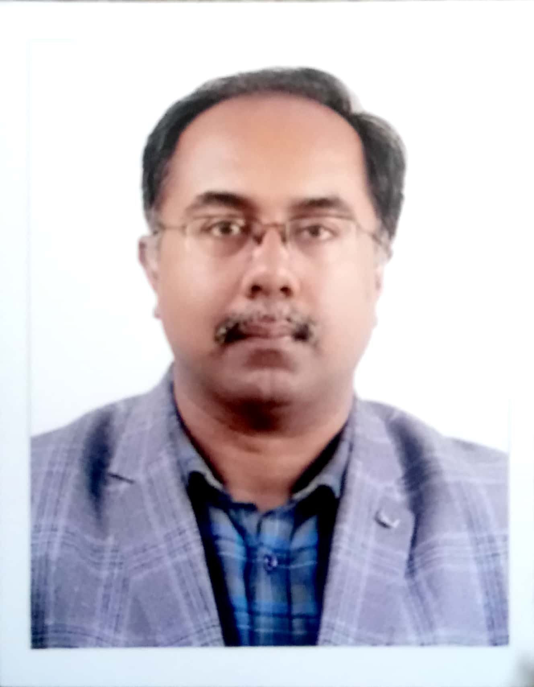
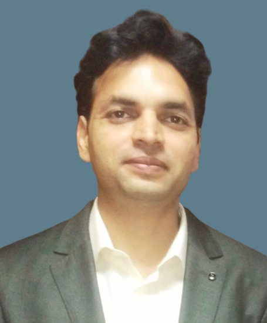
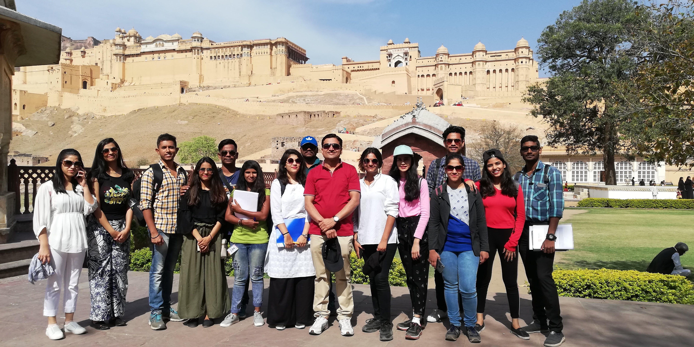
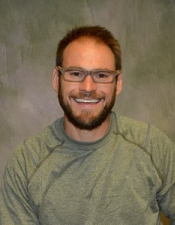
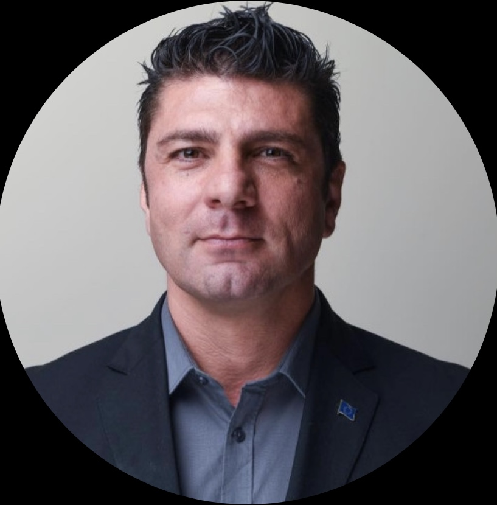
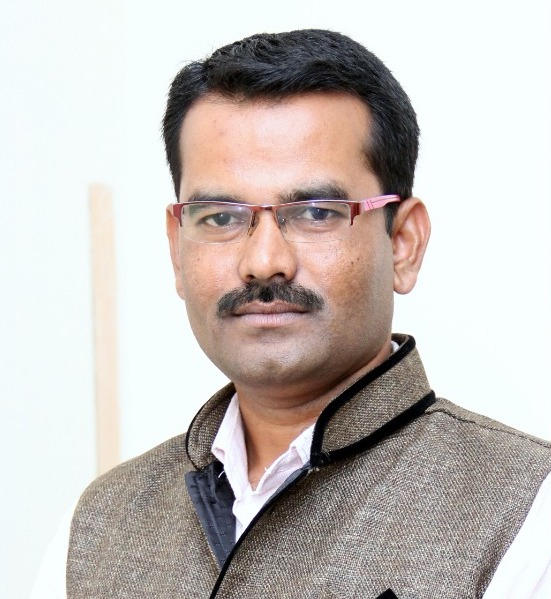
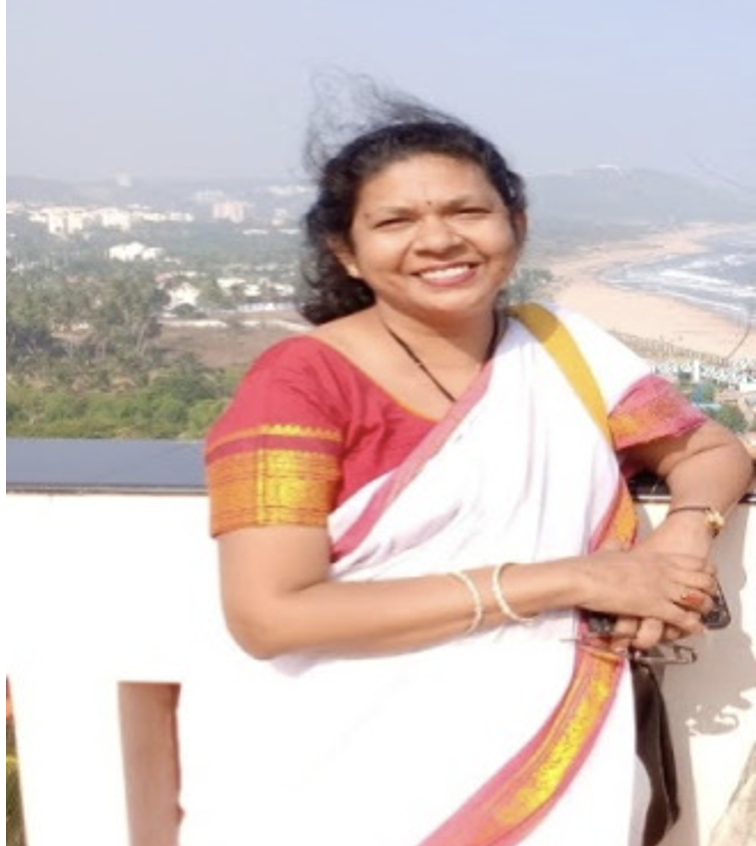
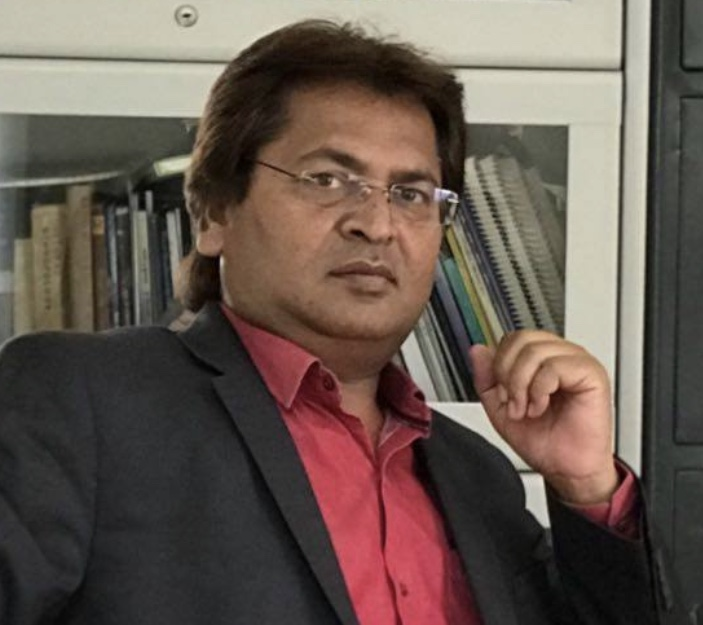

class: hide-count hide_logo

background-image: url("images/flyer.jpg")
background-size: contain
background-color: #E5E4E2

```{r setup, include=FALSE}
options(htmltools.dir.version = FALSE)
knitr::opts_chunk$set(
  fig.width=9, fig.height=3.5, fig.retina=3,
  out.width = "100%",
  cache = FALSE,
  echo = F,
  message = FALSE, 
  warning = FALSE,
  fig.show = TRUE,
  hiline = TRUE
)

library(here)
library(tidyverse)
library(tinytex)
library(emojifont)
library(magick)

library(xaringanExtra)
xaringanExtra::use_xaringan_extra(c("tile_view",
                                    "animate_css",
                                    "tachyons",
                                    "share_again",
                                    "webcam",
                                    "extra_styles",
                                    "logo"))

```

```{r xaringan-themer, include=FALSE, warning=FALSE}
library(xaringanthemer)
style_duo_accent(
  primary_color = "#1381B0",
  secondary_color = "#FF961C",
  inverse_header_color = "#FFFFFF"
)
```

```{r xaringan-logo, echo=FALSE, out.width="5%"}
xaringanExtra::use_logo(
  image_url = "images/logo.jpg",
  width = "70px",
  height = "108px"
)
```

---

class: hide_logo center middle hide-count

background-image: url("https://images.unsplash.com/photo-1551001626-86e913f8baf7?ixid=MXwxMjA3fDB8MHxwaG90by1wYWdlfHx8fGVufDB8fHw%3D&ixlib=rb-1.2.1&auto=format&fit=crop&w=2850&q=80")
background-size: cover

```{css echo=FALSE}
.hide-count .remark-slide-number {
  display: none;
}
```

<br>

# .orange.big-text[Welcome !]

## Department of Travel & Tourism

## Vishwakarma University, Pune - India `r emo::ji("india")`

#### `r format(Sys.Date(), "%d %B %Y")`
---

# World Heritage Day 18 April 2021

- Proposed by International Council on Monuments and Sites (ICOMOS) on 18 April 1982 and approved by the General Assembly of UNESCO in `1983`.

--

- The aim is to promote awareness about the diversity of cultural heritage of humanity, their vulnerability and the efforts required for their protection and conservation

.footnote[
Source: Smirnov, Lucile. "18 April - History - International Council on Monuments and Sites". www.icomos.org
]

---

# Department of Travel and Tourism

- We are young, dynamic and passionate `team with dreams` under Faculty of Humanities and Social Sciences

<br>

.pull-left[
```{r , out.width="55%", fig.cap="Dr. Chetan Kapadnis <br>Dean, Assoc. Prof.", fig.align='center'}
knitr::include_graphics("https://www.vupune.ac.in/images/Faculty/rsz_10063_chetan_kapadnis.jpg")
```
]

.pull-right[
```{r , out.width="55%", fig.cap="Ms. Aarti Suryawanshi <br>HOD, Assist. Prof.", fig.align='center'}

```
]

---

# Department of Travel and Tourism

- We are young, dynamic and passionate `team with dreams` under Faculty of Humanities and Social Sciences
<br>
<br>

.left-column.center[
```{r, out.width="70%", fig.cap="Dr. Bivek Datta <br>Assoc. Prof."}

```
]
.left-column.center[
```{r, out.width="65%", fig.cap="Mr. Sandeep Kapse <br>Assist. Prof."}
knitr::include_graphics("images/sandeep.jpg")
```
]

.left-column.center[
```{r , out.width="70%", fig.cap="Dr. Ajay Koli <br>Assist. Prof."}

```
]

---

# Department of Travel and Tourism

- We are young, dynamic and passionate `team with dreams` under Faculty of Humanities and Social Sciences
<br>
<br>

.left-column.center[
```{r , out.width="80%", fig.cap="Mr. Nishant Sutare <br>Assist. Prof."}
knitr::include_graphics("images/nishant.jpg")
```
]

.left-column.center[
```{r , out.width="65%", fig.cap="Mr. Remi Thomas <br>Assist. Prof."}
knitr::include_graphics("images/remi.jpg")
```
]

.left-column.center[
```{r , out.width="80%", fig.cap="Ms. Palak Tuteja <br>Assist. Prof."}

```
]

---

# Department of Travel and Tourism

- We are young, dynamic and passionate `team with dreams` under Faculty of Humanities and Social Sciences
<br>
<br>

```{r , out.width="60%", fig.cap="Soul of the house our beloved students (Batch 2018-21)", fig.align='center'}

```

---

class: center middle

```{r out.width="27%"}
knitr::include_graphics("https://www.vupune.ac.in/images/Faculty/rsz_1vc_sir_2.jpg")
```

# .orange[Prof.(Dr.). Siddharth Jabade]
# Vice-Chancellor & Professor
## Vishwakarma University, Pune - India

---

# .orange[Prof.(Dr.). Siddharth Jabade]

- He has completed his PhD from `IIT Bombay`.

--

- He has `multi-faceted experience` in the field of education, research, innovation, intellectual property rights and technology commercialization.

--

- He is a qualified `patent attorney` and mentored several innovative projects right from ideation to commercialization. He is `co-inventor` of the affordable
housing technology for SMART GRAM-an initiative by President of India office.

--

- He was `Director`, Innovation and IPR at Asian Institute of Technology, Thailand.

--

- He has been an `International Consultant` for Asian Development Bank, UNESCO and resource person to the World Intellectual Property Organization.

---
class: hide_logo hide-count

background-image: url("images/flyer12.jpg")
background-size: contain
background-color: #E5E4E2

---

# Speaker's Profile:

.left-column.center[

```{r}

```

]

.right-column[
# .orange[Dr. Kyle M. Woosnam]

### Assoc. Professor, University of Georgia - USA

### Sustainable tourism; Cultural-heritage tourism; Community tourism

#### Topic: Residents of Key International Markets perspectives of visiting the U.S. in a time of COVID-19

#### `r emo::ji("date")` 12 April, 2021 `r emo::ji("clock4")` 4:00 to 5:30 PM IST

]


---

# Dr. Kyle M. Woosnam

- At present he is an `Associate Professor` of Parks, Recreation & Tourism Management at the University of Georgia in the USA and a teaching position at the University of Johannesburg (SA) also.

--

- Prof. Kyle earned his `PhD` at Clemson University in 2008. He is an alumnus of Virginia Tech and University of Illinois.

--

- He got `twenty years` of teaching experience at prestigious institutions like Texas A&M University, University of Surrey, Clemson University, and Mississippi State University. He got five to six years of tourism industry exposure as well. 

--

- During these years he received nine different awards for his teaching. In 2020, he was awarded by the University of Georgia Warnell Alumni Association Faculty Award for `Outstanding Teaching`.

---

# Dr. Kyle M. Woosnam

- He has published `92` peer reviewed journal articles while conducting research across `29` countries. 

--

- Seven times he has received different awards for his research work. In 2021, he was awarded the `2020 Best Reviewer Award` for Journal of Hospitality and Tourism Management.

--

- He has contributed `6` book chapters and `130` Conference presentations with published abstracts/proceedings.

--

- He is frequently interviewed by the media for his `brilliant scholarship` and contribution in the field of travel and tourism.

--

- Total `18 research scholars` have completed PhD under his supervision.

.footenote[
Source: [online CV]( https://www.warnell.uga.edu/sites/default/files/directory/cvs/Woosnam%20CV%20for%20UGA%20webpage%20%28January%202021%29.pdf)
]

---

class: hide-count hide_logo

background-image: url("images/flyer-15.jpg")
background-size: contain
background-color: #E5E4E2

---

# Speaker's Profile:

.left-column.center[

```{r}

```

]

.right-column[
# .orange[Dr. Fabio Carbone]

### Senior Academician, Coventry University - UK

### Cultural Heritage Management; International Tourism Management; Intercultural Dialogue; Cultural Diplomacy

#### Topic: Cultural Heritage Management 

#### `r emo::ji("date")` 15 April, 2021 `r emo::ji("clock4")` 4:00 to 5:00 PM IST
]

---

# Dr. Fabio Carbone

- Senior Researcher at Centre for Trust, Peace & Social Relations at `Coventry University`, U.K

- `Ambassador-at-large` of the International Institute for Peace Tourism (IIPT), New York. Also IIPT Special Envoy to Iran (Founder of IIPT Iran Chapter)

- `Member of Scientific Council` of Places of Peace Route, Member of Global Diplomatic Forum and Observer Member of Portugese Steering Committee for HERITY (World Organisation for the Certification of Quality Management of Cultural Heritage)

- Former `Adviser` of ASCIP Dante Alighieri’s Executive Board for Activities of Cultural Diplomacy in Portugal

- Served as an `International Volunteer` w.r.t European Volunteer Service and other campaigns in Serbia, Bosnia, Albania, Ecuador, Bangladesh & Iran

---

class: hide-count hide_logo

background-image: url("images/flyer16.jpg")
background-size: contain
background-color: #E5E4E2

---

# Speaker's Profile:

.left-column.center[

```{r}

```

]

.right-column[
# .orange[Mr. Chandrashekhar M. Wankhede]

### Contributory Assistant Professor, Shivaji University, India; Sub-Editor - Lokmat Times; Executive Editor - Nuturing Age

#### Topic: Environmental Law and Tourism

#### `r emo::ji("date")` 16 April, 2021 `r emo::ji("clock4")` 4:00 to 5:00 PM IST
]

---

# Mr. Chandrashekhar M. Wankhede

- Having experience in `journalism`, research and academic fields. 

- Collaboratively fulfilled research with `UNICEF` India.

- Implemented new syllabus on `SDG` (Sustainable Development Goals) at Shivaji University,Kolhapur.

- Published `research papers` in national and international journals, contributed chapters in books and presented research papers in state, National and international level conferences.

- He has also a member of `editorial board` for two research books, Member of the `Board of Studies` in Journalism and Mass Communication, Sanjay Ghodawat University, Kolhapur.

---

# Speaker's Profile:

.left-column.center[

```{r}

```

]

.right-column[
# .orange[Dr. A. Lajwanti Naidu]

### Assistant Director, Capacity Building Andhra Pradesh Tourism Authority - India

### Responsible Tourism; Sustainable Tourism

#### Topic: Career opportunities in Responsible Tourism...An Entrepreneur perspective

#### `r emo::ji("date")` 16 April, 2021 `r emo::ji("clock5")` 5:00 to 6:00 PM IST
]

---

# Dr. A. Lajwanti Naidu

- Dr. A. Lajwanti Naidu is presently associated with Andhra Pradesh Tourism as `Assistant Director` - Strategy,working with a project from World Bank on development of beaches across the coast of Andhra Pradesh 
- She holds a `PhD` in Tourism.

- She is also an IATA `Certified Instructor` from Montreal, Canada. 

- She pursued her advance certification course in Tourism from `Cambridge University London.`

- She received `Responsible Tourism Gold Award` for her work with folktales empowering local women at Munsuari Uttarakhand

- She has successfully imparted training programs to several students at `Amity University` Noida and Air Force Vocational College New Delhi; Associated with Open Eyes Project in `Spain` and Yuva Parivartan of Kherwadi Foundation `Mumbai`

---

class: hide-count hide_logo

background-image: url("images/flyer17.png")
background-size: contain
background-color: #E5E4E2

---

# Speaker's Profile:

.left-column.center[

```{r}

```

]

.right-column[
# .orange[Dr. Madhuri Sawant]

### Director - International Centre for Buddhist Tourism, Assistant Professor, Dr. Babasaheb Ambedkar Marathwada University - India 

#### Topic: Ajanta caves- Art, appreciation and Management 

#### `r emo::ji("date")` 17 April, 2021 `r emo::ji("clock3")` 3:00 to 4:00 PM IST

]

---

# Dr. Madhuri Sawant

- During 2017-2020 she was the Executive Secretary of `Euro-Asia Tourism Studies Association` (EATSA). As an Expert Member of Tourism, she is working on the Government of India’s `University Grants Commission` and various prominent Academic Committees of Tourism in over 18 Universities in India.

- A post graduate in Tourism Administration (MTA) she is the `First UGC NET-JRF` and also first Woman to be awarded `PhD in Tourism` in the state of Maharashtra, India. She also holds PG Diplomas in Business Management, German Language and Environmental Studies.

- Her principal `research interests` are Marketing, CSR, Socio-Economic Aspects and Heritage Tourism Management and has completed 05 Major Research Projects sponsored by University Grants Commission (UGC), Indian Council for Social Science Research (ICSSR) and Ministry of Tourism Government of India and has also worked as the Research Coordinator of India on the `International Project` with academicians from Europe and Asia. ...

---

# Dr. Madhuri Sawant

- As a frequent traveler for academic and Research Assignments, she has `visited various universities` in, Portugal, Japan, France, United Arab Emirates, Thailand, Chile and South Korea.

- She has over `46 publications` including 06 books and 29 refereed journal articles and book chapters to her credit and has organized Four International and 12 National Seminars/Conferences/Workshops.

- As a `Research Supervisor`, she is guiding Doctoral Research Fellows from United Kingdom, Japan, Thailand, Kenya, Yemen on Health tourism, Creative tourism, Corporate Social Responsibility, Human Resources in tourism, Internet Marketing, Destination Branding, Film Tourism, Crime & Tourism and evaluated several doctoral thesis & conducted Open Viva-Voce. ...

---

# Dr. Madhuri Sawant

- She has delivered Keynotes, Valedictory Address, chaired number of technical sessions in `National and International Conferences` and is a prominent Resource Person for the training programs for Government Tourism Officers / Immigration Officers / Staff, Approved Regional Tourist Guide, and Refresher/ Orientation Courses for University and College Teachers.

- Dr Sawant has designed over `24 courses` / programs in Tourism and Hospitality Management.

---

# Speaker's Profile:

.left-column.center[

```{r}

```

]

.right-column[
# .orange[Dr. Rajesh Ragde]

### Director, Department of Tourism Administration, Dr. Babasaheb Ambedkar Marathwada University - India

### Tourism planning & policies; Hospitality management; HR

#### Topic: World Heritage in Danger

#### `r emo::ji("date")` 17 April, 2021 `r emo::ji("clock4")` 4:00 to 5:00 PM IST
]

---

# Dr. Rajesh Ragde

- Tourism `Expert Member` of UGC, MPSC, Govt of Maharashtra, CBSE, CIVE, Ministry of Tourism -Government of India and other prominent academic committees of 36 Universities in India. 

- A PG in Tourism Administration (MTA), he is the `First Researcher` in Maharashtra, India to be awarded Ph.D. in Tourism Planning & Development. He also holds Post graduate degrees in Physics & Electronics, Business Management and Education.

- Dr Rajesh has a number of facets of his personality and his academics, basically a Physicist, a Scientist has conducted his `pioneer Research` on Tourism Planning & Development, Ambedkar Tourism, Tourist Police, Ecotourism, Rural Tourism, Cultural Tourism, Fort Tourism, Sufi Tourism and Medical Tourism, his interpretations are rational and scientific, his findings have been included in the UG, PG & UGC- CBSE NET Tourism Programmes, Course Curricula and reflected in the Tourism Planning and Policy documents especially his research on “Sustainable Medical Tourism”. ...

---

# Dr. Rajesh Ragde

- Dr Rajesh has taken an special Initiative for conducting `Scientific Heritage Research` in India,
Currently he is investigating and analysing the Degradation of the Natural & Cultural Heritage of Lonar Crater under the project sponsored by the Ministry of Science and Technology, Government of India.

- A `versatile persona`, Dr Rajesh is a visionary Director, an efficient Administrator, Academic Planner, Eminent Social Scientist, a Scholar of Buddhism, a Avid Reader having a personal library of over Five Thousand Books, a Professional Photographer whose work on Tourism Sites have been exhibited across India, an amateur Archaeologist who has made significant discoveries at Ghatatkocha caves and identifying the site of the ancient town of "Rajtadaga", an Art Collector having over 1000 artefacts.

---

class: hide-count hide_logo center middle

background-image: url("images/lastday.png")
background-size: cover
background-color: #E5E4E2

.white[`r emo::ji("party")` `r emo::ji("party")` event successfully completed <br>team (including Bivek & Payal) click <br>for our memory]

---

# Be in touch !

## `r emo::ji("envelope")` : [ajay.koli@vupune.ac.in](ajay.koli@vupune.ac.in)

## `r emo::ji("link")` : [https://vu-tourism.netlify.app/](https://vu-tourism.netlify.app/)

## `r emo::ji("university")` : [https://www.vupune.ac.in/](https://www.vupune.ac.in/)

## `r emo::ji("phone")` : 8886810879


---

class: center middle hide-count

# .big-text[Thank you <br>`r emo::ji("smile")`]