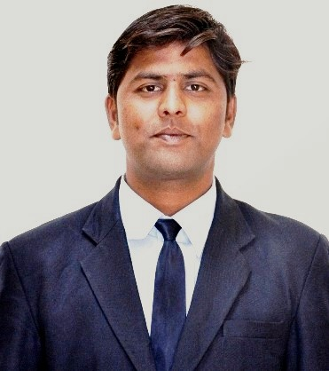

class: hide-count hide_logo

background-image: url("images/flyer.jpg")
background-size: contain
background-color: #E5E4E2

```{r setup, include=FALSE}
options(htmltools.dir.version = FALSE)
knitr::opts_chunk$set(
  fig.width=9, fig.height=3.5, fig.retina=3,
  out.width = "100%",
  cache = FALSE,
  echo = F,
  message = FALSE, 
  warning = FALSE,
  fig.show = TRUE,
  hiline = TRUE
)

library(here)
library(tidyverse)
library(tinytex)
library(emojifont)
library(magick)

library(xaringanExtra)
xaringanExtra::use_xaringan_extra(c("tile_view",
                                    "animate_css",
                                    "tachyons",
                                    "share_again",
                                    "webcam",
                                    "extra_styles",
                                    "logo"))

```

```{r xaringan-themer, include=FALSE, warning=FALSE}
library(xaringanthemer)
style_duo_accent(
  primary_color = "#1381B0",
  secondary_color = "#FF961C",
  inverse_header_color = "#FFFFFF"
)
```

```{r xaringan-logo, echo=FALSE, out.width="5%"}
xaringanExtra::use_logo(
  image_url = "images/logo.jpg",
  width = "70px",
  height = "108px"
)
```

---

class: hide_logo center middle

```{css echo=FALSE}
.hide-count .remark-slide-number {
  display: none;
}
```

# .orange.big-text[Welcome !]

## Department of Travel & Tourism

## Vishwakarma University, Pune - India `r emo::ji("india")`

#### `r format(Sys.Date(), "%d %B %Y")`
---

# World Heritage Day 18 April 2021

- Proposed by International Council on Monuments and Sites (ICOMOS) on 18 April 1982 and approved by the General Assembly of UNESCO in `1983`.

--

- The aim is to promote awareness about the diversity of cultural heritage of humanity, their vulnerability and the efforts required for their protection and conservation

.footnote[
Source: Smirnov, Lucile. "18 April - History - International Council on Monuments and Sites". www.icomos.org
]

---

# Speaker's Profile:

.left-column.center[

```{r}
knitr::include_graphics("images/12april.jpg")
```

]

.right-column[
# .orange[Dr. Kyle M. Woosnam]

### Assoc. Professor, University of Georgia - USA

### Sustainable tourism; Cultural-heritage tourism; Community tourism

#### Topic: Residents of Key International Markets perspectives of visiting the U.S. in a time of COVID-19

#### `r emo::ji("date")` 12 April, 2021 `r emo::ji("clock4")` 4:00 to 5:30 PM IST

]

---

# Speaker's Profile:

.left-column.center[

```{r}

```

]

.right-column[
# .orange[Dr. Fabio Carbone]

### Senior Academician, Coventry University - UK

### Cultural Heritage Management; International Tourism Management; Intercultural Dialogue; Cultural Diplomacy

#### Topic: Cultural Heritage Management 

#### `r emo::ji("date")` 15 April, 2021 `r emo::ji("clock4")` 4:00 to 5:00 PM IST
]

---

# Speaker's Profile:

.left-column.center[

```{r}
knitr::include_graphics("images/16a-april.jpeg")
```

]

.right-column[
# .orange[Chandrashekhar M. Wankhede]

### Contributory Assistant Professor, Shivaji University, India; Sub-Editor - Lokmat Times; Executive Editor - Nuturing Age

#### Topic: Environmental Law and Tourism

#### `r emo::ji("date")` 16 April, 2021 `r emo::ji("clock4")` 4:00 to 5:00 PM IST
]

---

# Speaker's Profile:

.left-column.center[

```{r}

```

]

.right-column[
# .orange[Dr. A. Lajwanti Naidu]

### Assistant Director, Capacity Building Andhra Pradesh Tourism Authority - India

### Responsible Tourism; Sustainable Tourism

#### Topic: Career opportunities in Responsible Tourism...An Entrepreneur perspective

#### `r emo::ji("date")` 16 April, 2021 `r emo::ji("clock5")` 5:00 to 6:00 PM IST
]

---

# Speaker's Profile:

.left-column.center[

```{r}
knitr::include_graphics("images/17a-april.jpg")
```

]

.right-column[
# .orange[Dr. Madhuri Sawant]

### Director - International Centre for Buddhist Tourism, Assistant Professor, Dr. Babasaheb Ambedkar Marathwada University - India 

#### Topic: Ajanta caves- Art, appreciation and Management 

#### `r emo::ji("date")` 17 April, 2021 `r emo::ji("clock4")` 3:00 to 4:00 PM IST

]

---

# Speaker's Profile:

.left-column.center[

```{r}
knitr::include_graphics("images/17b-april.jpg")
```

]

.right-column[
# .orange[Dr. Rajesh Ragde]

### Director, Department of Tourism Administration, Dr. Babasaheb Ambedkar Marathwada University - India

### Tourism planning & policies; Hospitality management; HR

#### Topic: World Heritage in Danger

#### `r emo::ji("date")` 17 April, 2021 `r emo::ji("clock4")` 4:00 to 5:00 PM IST
]

---

# Department of Travel and Tourism

- We are young, dynamic and passionate `team with dreams` under Faculty of Humanities and Social Sciences

<br>

.pull-left[
```{r , out.width="55%", fig.cap="Dr. Chetan Kapadnis <br>Dean, Assoc. Prof.", fig.align='center'}
knitr::include_graphics("https://www.vupune.ac.in/images/Faculty/rsz_10063_chetan_kapadnis.jpg")
```
]

.pull-right[
```{r , out.width="55%", fig.cap="Ms. Aarti Suryawanshi <br>HOD, Assist. Prof.", fig.align='center'}
knitr::include_graphics("images/aarti.jpg")
```
]

---

# Department of Travel and Tourism

- We are young, dynamic and passionate `team with dreams` under Faculty of Humanities and Social Sciences
<br>
<br>

.left-column.center[
```{r, out.width="70%", fig.cap="Dr. Bivek Datta <br>Assoc. Prof."}
knitr::include_graphics("images/bivek.jpg")
```
]
.left-column.center[
```{r, out.width="65%", fig.cap="Mr. Sandeep Kapse <br>Assist. Prof."}
knitr::include_graphics("images/sandeep.jpg")
```
]

.left-column.center[
```{r , out.width="70%", fig.cap="Dr. Ajay Koli <br>Assist. Prof."}
knitr::include_graphics("images/ajay.jpeg")
```
]

---

# Department of Travel and Tourism

- We are young, dynamic and passionate `team with dreams` under Faculty of Humanities and Social Sciences
<br>
<br>

.left-column.center[
```{r , out.width="80%", fig.cap="Mr. Nishant Sutare <br>Assist. Prof."}

```
]

.left-column.center[
```{r , out.width="65%", fig.cap="Mr. Remi Thomas <br>Assist. Prof."}
knitr::include_graphics("images/remi.jpg")
```
]

.left-column.center[
```{r , out.width="80%", fig.cap="Ms. Palak Tuteja <br>Assist. Prof."}

```
]

---

# Department of Travel and Tourism

- We are young, dynamic and passionate `team with dreams` under Faculty of Humanities and Social Sciences
<br>
<br>

```{r , out.width="60%", fig.cap="Soul of the house our beloved students (Batch 2018-21)", fig.align='center'}
knitr::include_graphics("images/students.jpg")
```

---

class: center middle

```{r out.width="27%"}
knitr::include_graphics("https://www.vupune.ac.in/images/Faculty/rsz_1vc_sir_2.jpg")
```

# .orange[Prof.(Dr.). Siddharth Jabade]
# Vice-Chancellor & Professor
## Vishwakarma University, Pune - India

---

# Be in touch !

## `r emo::ji("envelope")` : [ajay.koli@vupune.ac.in](ajay.koli@vupune.ac.in)

## `r emo::ji("link")` : [https://vu-tourism.netlify.app/](https://vu-tourism.netlify.app/)

## `r emo::ji("university")` : [https://www.vupune.ac.in/](https://www.vupune.ac.in/)

## `r emo::ji("phone")` : 8886810879

---
class: hide_logo hide-count

background-image: url("images/flyer12.jpg")
background-size: contain
background-color: #E5E4E2
